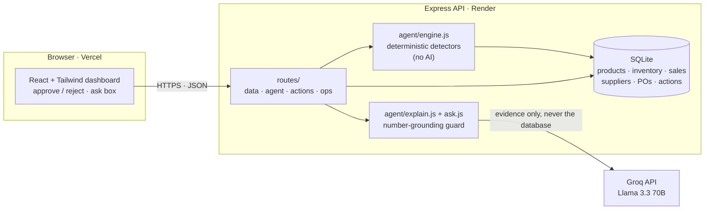

# Architecture

## The agent loop mapped to files

| Step | File | What it does |
|---|---|---|
| Observe | `agent/snapshot.js` | Loads stock, sales, suppliers, POs; computes demand rates |
| Reason · Evaluate · Decide | `agent/detectors/*` | Days of stock vs lead time; transfer first, then suppliers |
| Rank | `agent/engine.js` | Scores all findings and ranks them |
| Act | `routes/agent.js` + `db/actionsRepo.js` | Saves each finding as a `pending` action |
| Explain | `agent/explain.js` | Plain-English rationale with checked numbers |
| Ask | `agent/ask.js` | Answers questions from a data pack only |
